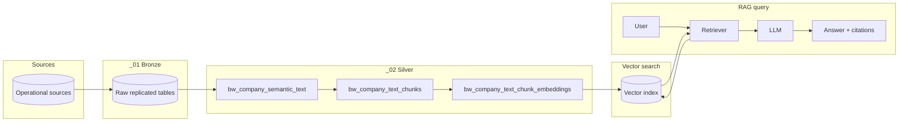

# Architecture

## RAG architecture diagram

## Medallion layers

1. **Bronze** — Raw replication into Unity Catalog with minimal transformation.
2. **Silver** — Cleaned/conformed entities plus the RAG feature tables:
   - `bw_company_semantic_text` → canonical per-company text
   - `bw_company_text_chunks` → chunked text
   - `bw_company_text_chunk_embeddings` → embeddings per chunk (requires an embedding endpoint)
3. **Gold** — Business-ready marts (not implemented in this repo).

## Pipelines

Orchestration is typically a Databricks **Workflow** that runs:

- **SQL tasks**: build Silver tables from Bronze
- **Notebook tasks**: create semantic text → chunk → embed (and optionally build/update the vector index)

## AI / RAG

- **Notebooks** (`notebooks/`): semantic text, chunking, embeddings, and RAG demos
- **Config** (`ai/config/`): endpoints, vector index, Genie settings
- **Library** (`ai/src/`): chunking, embedding, retrieval utilities

Adjust names, catalogs, and job definitions to match your Databricks workspace and deployment tooling.
